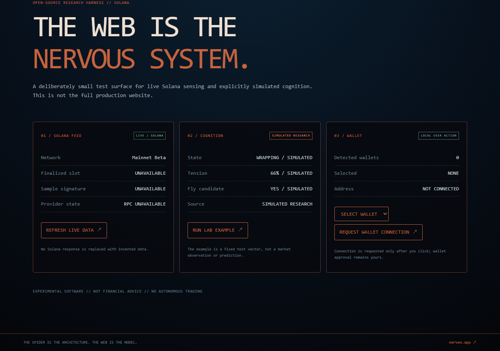
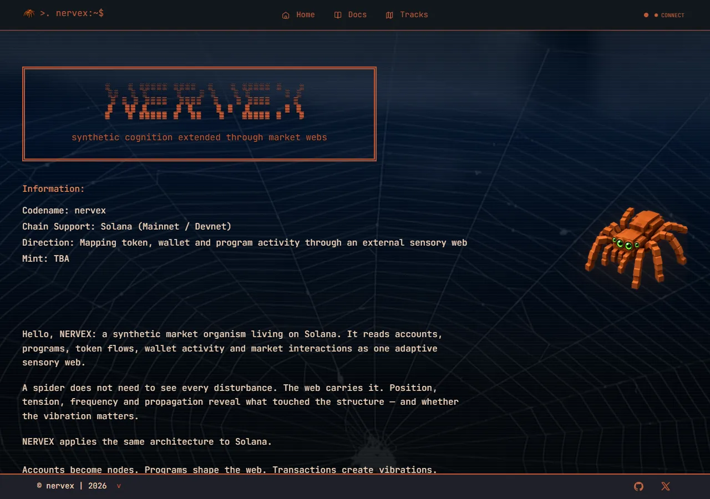

# NERVEX

> THE WEB IS THE NERVOUS SYSTEM.

**An extended market nervous system for Solana — experimental research software.**

NERVEX treats Solana as a dynamic network rather than a feed. Accounts become nodes; programs shape relationships; transactions create vibrations; token flows propagate through threads. The spider is a **computational abstraction**, not a claim that biology predicts markets.

[Website](https://nervex.app/) · [Docs](docs/architecture.md) · [Architecture](docs/architecture.md) · [Development](CONTRIBUTING.md) · [X](https://x.com/NERVEXTOKEN)

Network: **Solana** · Status: **Experimental / active development**

~~~text
 _   __ __________ _    _______  __
/ | / / ____/ __ \ |  / / ____/ |/ /
/  |/ / __/ / /_/ / | / / __/  |   /
/ /|  / /___/ _, _/| |/ /___ /   |
/_/ |_/_____/_/ |_| |___/_____//_/|_|
~~~

## Scope of this repository

This repository includes a snapshot of the static files currently served at [nervex.app](https://nervex.app/) in [site/](site/), plus an independently authored Solana-sensing research core and local harness. The production site is **static HTML/CSS/JavaScript with a Vercel Solana RPC function**, not React or Next.js. Its page shell originated from an earlier Framer-based reference; this history is disclosed in [third-party notices](THIRD_PARTY_NOTICES.md). **The MIT license does not automatically relicense third-party page code, models, fonts, media, or data.**

The harness is a real implementation, not a mock landing page: it requests live Solana RPC data through a local allowlisted proxy, discovers Wallet Standard providers, and runs explicit, separately labeled research models. Live requests can fail or be rate-limited; the UI reports **UNAVAILABLE** rather than inventing a result.

Research-harness screenshots (the production-site screenshots are listed below):

[Mobile view](assets/readme/harness-mobile.png)

Current Solana production site (captured from nervex.app):

[WEB–SOMA interface](assets/readme/web-soma.webp) · [Sensory Bus](assets/readme/sensory-bus.webp).

## Overview

| Term | Meaning |
| --- | --- |
| Web | External market/chain model |
| Node | Account, mint, program, wallet, or market |
| Thread | Relationship or interaction path |
| Vibration | Transaction or external market event |
| Tension | Normalized attention/activity weight, **not a price forecast** |
| Fly | Short-lived anomalous candidate, **not a trading recommendation** |
| Strike | A proposed committed observation before the outcome is known |
| Dragline | Historical trace |

Example of an honest signal record:

~~~text
NERVEX / SIGNAL
NODE       EPjFWdd…TDt1v
TYPE       TOKEN FLOW
SLOT       unavailable until RPC responds
TENSION    unavailable until all inputs are observed
STATE      CLASSIFYING / SIMULATED RESEARCH
SOURCE     LIVE / SOLANA for RPC fields; SIMULATED RESEARCH for model state
~~~

## Why a spider?

A spider's sensory system extends into its surrounding web. NERVEX borrows this idea as an architectural analogy: external disturbances are mapped into nodes and relationships before an explicit model classifies them. Biological morphology is a **reference layer**; financial sensing is a distinct computational layer. No scientific paper establishes a spider-brain market algorithm. See [research references](docs/references.md).

## Solana ↔ NERVEX mapping

| Solana concept | Visualization concept |
| --- | --- |
| Account | Node |
| Program | Active structure |
| Transaction | Vibration |
| Instruction | Micro-vibration |
| Mint | Asset node |
| Token account | Holding node |
| Wallet | Identity node |
| Program interaction | Thread response |
| Transaction history | Dragline |

NERVEX does not replace Solana terminology internally. The metaphor belongs to the visualization and analysis layer. See [Solana model](docs/solana-model.md).

## WEB–SOMA

The production site explores SOMA (body), CNS (integration reference), WEB (external sensory surface), and SIGNAL (propagation) with orbit controls, layer switching, node selection, and inspector readouts. Its 3D interface is experimental; its biological and market layers must remain visibly distinct. The deployed runtime and attributed models are in site/; their respective licenses are **not replaced by this repository's MIT license**. The research core contains separate state and scoring primitives that can be evaluated independently. See [WEB–SOMA model](docs/web-soma.md).

## Architecture

~~~text
Research harness UI
       │
       ├── LIVE / SOLANA → allowlisted local RPC proxy → Solana RPC
       ├── Wallet Standard → user-controlled connect request
       └── SIMULATED RESEARCH → cognition / tension / fly models
~~~

There is no autonomous trading engine, prediction service, or onchain registry in this repository. See [architecture](docs/architecture.md).

## Implementation status

| System | State here | Boundary |
| --- | --- | --- |
| Terminal research harness | Working prototype | Local demo, not production site shell |
| Solana finalized slot & block sample | Live when RPC responds | Public RPC can rate-limit |
| Wallet Standard discovery/connect | Working prototype | User approval in wallet required |
| Tension formula | Tested experimental model | Test vector in demo, not a price signal |
| Cognition state machine | Tested explicit model | Simulated, not an LLM or consciousness |
| Fly score | Tested experimental model | Simulated, not scam detection |
| WEB–SOMA 3D | Production-site experiment | Deployed runtime in site/; third-party assets attributed |
| Signed strike | Research specification | No signing flow or registry here |
| Onchain registry | Not deployed | No contract in this repository |

## Data modes

- **LIVE / SOLANA**: responses from the selected Solana cluster via the local RPC proxy.
- **EXTERNAL MARKET**: non-Solana market data; no provider is configured in this repository.
- **SIMULATED RESEARCH**: fixed examples and experimental state transitions.

The sample cognition and fly outputs are simulated even while a separate live RPC panel is active. See [data sources](docs/data-sources.md).

## Running locally

Requirements: Node.js **22 or newer**, npm, and a modern browser. No Docker, Rust, or Anchor is required. A Solana Wallet Standard-compatible browser wallet is optional. The production site's WEB–SOMA 3D view needs WebGL; this research harness does not.

~~~sh
git clone https://github.com/theovarne/nervex.git
cd nervex
npm ci
cp .env.example .env.local
npm run dev
~~~

Open <http://127.0.0.1:3000> for the separate research harness. The server binds to localhost only. For Devnet, open <http://127.0.0.1:3000/?cluster=devnet>. On Windows PowerShell, Copy-Item can replace cp.

To inspect the **actual production static site** locally, run python -m http.server --directory site 4173 and open <http://127.0.0.1:4173>. A plain static server does not run site/api/solana.js; live RPC panels will correctly show unavailable. For the API route, use a Vercel development environment with site/ as the project root.

npm run dev serves the source harness and its local RPC proxy. npm run build creates a static build/ artifact; it does **not** create a deployable RPC service. A static host needs a separately configured RPC proxy.

## Environment

| Variable | Purpose |
| --- | --- |
| PORT | Local port; defaults to 3000 |
| SOLANA_MAINNET_RPC_URL | Optional server-side Mainnet RPC URL |
| SOLANA_DEVNET_RPC_URL | Optional server-side Devnet RPC URL |

Do not expose provider credentials in browser bundles. If unset, the local server uses Solana's public endpoints. No token mint or paid market provider is configured here.

## Repository structure

~~~text
demo/            local terminal UI
site/            current production static HTML/CSS/JS, RPC function and assets
src/core/        provenance, tension, state machine, anomaly, address helpers
src/solana/      RPC client and Wallet Standard discovery
scripts/         local server, build, lint
tests/           Node unit tests
docs/            architecture, research models, sources, security boundaries
.github/         CI, Dependabot, issue and PR templates
~~~

## Research references

The [reference list](docs/references.md) names primary Solana documentation, biological literature, and open-source inspiration. [Third-party notices](THIRD_PARTY_NOTICES.md) distinguish references from reused production-site files. The independently authored research core does not copy the cited reference implementations; the production snapshot does contain separately licensed vendor modules and attributed models.

## Current limitations

- Public RPC availability, finality lag, and rate limits affect live reads.
- The cognition layer is an explicit experimental state machine, not autonomous consciousness.
- Fly and tension scores are research abstractions with no validated predictive accuracy.
- Wallet connection does not grant NERVEX access to private keys; this harness does not request transactions or signatures.
- No external market provider, signed strike registry, or onchain program is shipped here.
- The production snapshot contains third-party material with separate license/attribution boundaries; do not assume the root MIT license covers all of site/.

## Research roadmap

- **MOLT 001 — SOLANA SENSING:** expand test fixtures and error handling.
- **MOLT 002 — PERSONAL WEB:** derive local topology from user-approved wallet data.
- **MOLT 003 — SPL TOKEN LAYER:** represent Token and Token-2022 without conflating them.
- **MOLT 004 — PROGRAM SENSING:** classify instruction and account relationships.
- **MOLT 005 — SIGNED STRIKE:** optional user-approved signed observation.
- **MOLT 006 — ONCHAIN MEMORY:** research-only registry proposal, not deployed.

These are research directions, not promises or release dates.

## Contributing, security, license

See [CONTRIBUTING.md](CONTRIBUTING.md) for commands and PR expectations, [SECURITY.md](SECURITY.md) for private vulnerability reports, and [LICENSE](LICENSE) for MIT terms covering NERVEX-authored code and documentation. [THIRD_PARTY_NOTICES.md](THIRD_PARTY_NOTICES.md) controls separate third-party notices. Do not submit wallet keys, RPC credentials, or unlicensed assets.

---

NERVEX is experimental market-intelligence research. It does not provide financial advice or guarantee market outcomes.

The spider is the architecture. The web is the model. Solana is the environment.

**THE WEB IS THE NERVOUS SYSTEM.**
